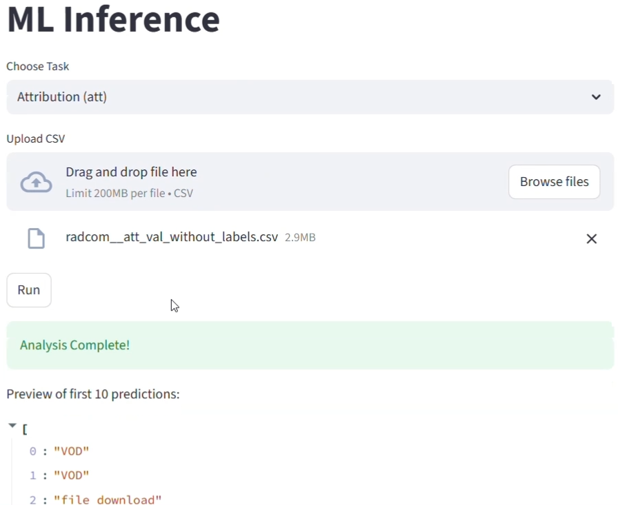

# Encrypted Network Traffic Classifier

## Introduction
Developed as part of a cybersecurity competition sponsored by Radcom, this project implements a high-performance distributed system for encrypted network traffic classification.  
The system classifies traffic into 128 applications and 5 attribution categories using a microservices architecture (FastAPI, Celery, Redis, Streamlit), fully containerized with Docker.

---

## Demo

▶ Watch the full system demonstration video:
<p align="center">
  <a href="https://youtu.be/Oacadj3C_Ns">
    
  </a>
</p>

---

## System Architecture
The project is built as a distributed system to handle high-volume traffic analysis:

* Streamlit UI: A user-friendly web interface for uploading CSV traffic data.
* FastAPI (Inference API): A lightweight REST API that handles requests and manages the task queue.
* Redis: Acts as the message broker for asynchronous processing.
* Celery Worker: The "heavy lifter" that loads the ML models once and performs the inference.
* Docker: Separates the environment into optimized containers for the app and the worker.

---

## Repository Scope
This repository showcases the system design, model training pipeline and distributed deployment architecture.  
Due to competition constraints and size limitations, the dataset and trained model files are not included.

---

## Machine Learning Approach
* Models: Random Forest classifiers selected for robustness under limited labeled data and resistance to overfitting in encrypted traffic scenarios.
* Feature Engineering:
    - TLS Fingerprinting: Using the first packet sizes to identify unique app patterns.
    - Behavioral Analysis: Using "Silence Windows" and "Inter-Arrival Time" to distinguish between streaming, VoIP, and chat.
* Efficiency: Models are loaded into memory as singletons during worker startup to ensure sub-second inference times.

---

## Project Structure
```
.  
├── Dockerfile.app          # Docker config for API and UI  
├── Dockerfile.worker       # Docker config for the ML Worker  
├── docker-compose.yml      # Service orchestration  
├── api.py                  # FastAPI implementation  
├── tasks.py                # Celery tasks and ML logic  
├── worker.py               # Worker entry point  
├── streamlit_app.py        # UI implementation  
├── requirements-app.txt    # Light-weight dependencies  
├── requirements-worker.txt # Heavy ML dependencies  
├── application_model.py    # Application training script  
├── attribution_model.py    # Attribution training script  
├── predictions/            # Output prediction files  
└── docs/                   # Project presentation
```

---

## Features
- Asynchronous Task Queue (Redis/Celery)
- OpenAPI Standards (FastAPI /docs)
- Optimized Inference (Singleton model loading)
- Scalable Design (Distributed Workers)
- Decoupled API and ML worker architecture

---

## Project Presentation
You can view the project presentation here:  
[Project Slides](docs/presentation.pdf)
